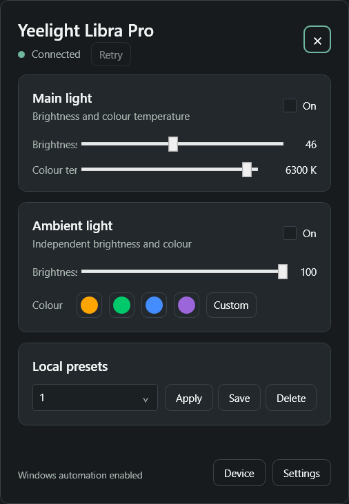
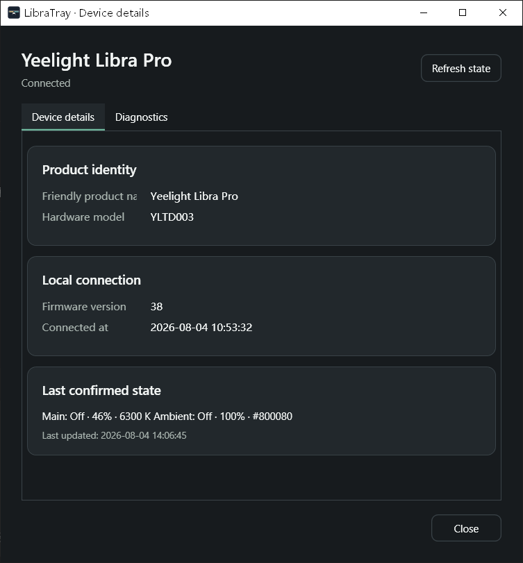
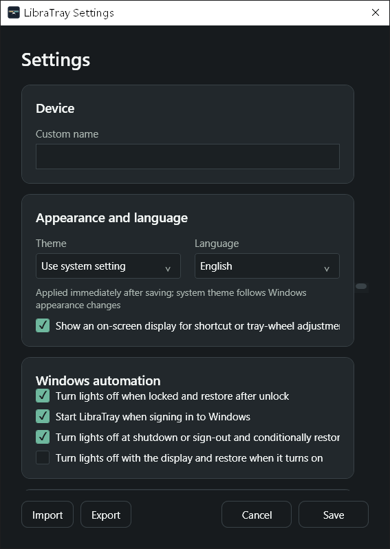
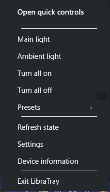

# LibraTray

<p align="center">
  
</p>


LibraTray 是一个正在开发中的、托盘优先、纯局域网的 Windows 控制器，目标设备为
**Yeelight Libra Pro**。该产品也常以 **Yeelight LED Screen Light Bar Pro**
或 **Yeelight Monitor Light Bar Pro** 销售，硬件型号为 **YLTD003**，局域网协议
内部型号为 `lamp15`。项目重点是即时控制和可靠的双通道状态同步。
其他设备型号不在支持范围或兼容规划内。

> **当前状态：**v1.0.1 实现已通过维护者在 Windows 上进行的硬件、安装、卸载、控制、
> 自动化和界面检查。是否已经公开发布，以项目的
> [GitHub Releases](https://github.com/tHank-CS/LibraTray/releases) 页面为准。
> 本版本暂无代码签名。氛围灯左右分区 RGB 命令虽能即时生效，但它与已观察到的冷启动
> 故障之间尚未完成因果隔离，因此在 v1.0.1 中仍未开放。项目现已允许后续在明确风险边界下
> 实现默认关闭的实验入口，但该入口尚未完成。

[English](README.md) | 简体中文

## 截图

<table>
  <tr>
    <td align="center">
      
      <br><sub>快速控制面板</sub>
    </td>
    <td align="center">
      
      <br><sub>设备详情</sub>
    </td>
  </tr>
  <tr>
    <td align="center">
      
      <br><sub>设置</sub>
    </td>
    <td align="center">
      
      <br><sub>托盘菜单</sub>
    </td>
  </tr>
</table>

## 为什么创建 LibraTray？

现有 Yeelight 工具通常是智能家居集成、通用灯泡客户端，或针对其他显示器挂灯的工具。
LibraTray 刻意保持更窄的范围：

- 只通过局域网工作，不要求小米/Yeelight 账号、云端 Token 或公网服务；
- 分别维护主灯与氛围灯状态；
- 提供紧凑的 Windows 托盘工作流，而非常驻仪表盘；
- 明确协调软件命令、设备通知、状态查询与实体旋钮产生的变化；
- 先通过诊断探测工具验证协议，再把产品专用行为放入正式应用。

这些约束已经落实在协议探针、可测试核心与托盘应用中，不再只是后续设计目标。

## 支持设备与身份

| 显示名称 | 硬件型号 | 内部型号 | 状态 |
| --- | --- | --- | --- |
| Yeelight Libra Pro | YLTD003 | `lamp15` | 唯一支持设备；固件 38 的部分阶段 B 行为已实机验证 |

Yeelight 官方资料对 YLTD003 使用了不止一个商品名。`lamp15` → YLTD003 →
Yeelight Libra Pro 是基于多个官方来源形成的**高可信跨来源推断**，而不是 Yeelight
在单一声明中给出的全球统一命名。LibraTray 选择“Yeelight Libra Pro”作为默认友好名，
同时分开保留硬件型号和内部型号供诊断使用。详见
[产品身份调研](docs/research/product-identity.md)。

项目绝不会仅凭名称中出现“Libra”“Pro”或“Screen Light Bar”就识别设备。未知型号
保持未知且不受支持；其他 Libra、Pro、Pura 或 YLTD 产品不属于计划兼容目标。

## 功能

当前里程碑已有：

- Yeelight 局域网 UDP 发现；
- 手动地址协议探测；
- 以 CRLF 分隔的 JSON 请求/响应分帧；
- 命令 ID、超时、取消和有界输入处理；
- 安全的产品身份映射与未知设备回退；
- 面向脱敏的诊断输出；
- Windows 托盘图标、右键菜单与实时快速面板；
- 已验证的主灯电源、亮度，以及采用向 Yeelight 官方查证产品范围的 2700–6500 K 主灯
  色温控制；界面默认限制为 3000–6400 K，可在设置中明确允许两端极限色温；
- 已验证的氛围灯电源、亮度和整灯 RGB 预设；
- 有界重试、通知复读和单连接命令节流；
- 带冲突提示、输入排队和单实例保护的固定全局快捷键；
- 可捕获按键的快捷键修改、可配置调节步进和设备别名；
- 本地预设与经过验证的整灯自定义 RGB 输入；
- 带损坏回退和原子替换的版本化设置；
- 带格式校验、预览和隐私提示的版本化配置导入/导出；
- 浅色、深色、跟随 Windows 的主题，以及可即时切换的简体中文/英文资源；
- 用于快捷键和托盘滚轮调节、可关闭且不抢焦点的亮度/色温屏幕提示；
- 可选的锁屏/显示器电源联动及受保护的关机/启动恢复；
- 精简的设备信息窗口和可选的有界脱敏诊断摘要；
- 自动化测试与模拟设备测试面。

版本信息：[v1.0.1 发布说明](docs/releases/v1.0.1.zh-CN.md)。

屏幕拾色、音乐/游戏灯效以及通用 Yeelight 客户端不属于首个稳定版范围。

## 系统要求

- Windows 10 21H2（内部版本 19044）或更高版本，或 Windows 11；
- x64 处理器；
- 从源码构建需要 .NET 10 SDK；
- 电脑与挂灯位于同一可信局域网，且网络允许组播；
- 如果当前地区与固件的 Yeelight/米家应用提供局域网控制开关，需要先启用它。

仅仍处于 Microsoft 服务周期内的 Windows 版本属于正式支持范围。在已停止服务的
Windows 构建上运行只能视为尽力兼容。

## 下载、安装与便携版

官方文件只通过项目的
[GitHub Releases](https://github.com/tHank-CS/LibraTray/releases) 页面分发。如果
该页面没有 Release，就表示尚无官方二进制文件。请勿从非官方软件下载站获取
LibraTray。每个经过复核的 Release 都会提供：

- `LibraTray-<版本>-win-x64.zip`：自包含便携版，解压到当前用户可写目录后运行
  `LibraTray.exe`；
- `LibraTray-<版本>-win-x64.msi`：仅为当前用户安装到
  `%LOCALAPPDATA%\Programs\LibraTray`；安装向导允许选择其他当前用户可写目录，并在
  执行前要求确认，无需管理员权限；
- `SHA256SUMS.txt`：两个软件包的 SHA-256 校验值。

项目目前没有代码签名证书，Windows 可能显示未知发布者或 SmartScreen 警告。运行前
请使用 `SHA256SUMS.txt` 校验下载文件。

## 首次连接与协议探测

1. 将 Yeelight Libra Pro 与电脑连接到同一可信局域网。
2. 如果厂商应用在当前设备、固件和地区提供“局域网控制”，请先启用。
3. 将 Windows 网络配置文件设为“专用”。如果防火墙询问，只允许专用网络。
4. 查看当前版本探测工具的命令：

   ```powershell
   dotnet run --project tools/LibraTray.Probe -- --help
   ```

5. 启动发现：

   ```powershell
   dotnet run --project tools/LibraTray.Probe -- discover
   ```

6. 在尝试任何产品专用实验前，确认原始型号精确为 `lamp15`。先执行只读发现与状态
   检查，不发送未记录命令。

v0.1.0 前命令行可能调整；当前检出版本的 `--help` 才是准确信息。实机测试前请阅读
[测试指南](docs/testing-guide.md)。默认 JSONL 日志创建在
`%LOCALAPPDATA%\LibraTray\logs`。如果使用 `--log-path`，必须指定一个尚不存在的
新文件；探针不会追加或覆盖已有日志。

## 托盘、快捷键与 Windows 自动化

托盘图标、右键菜单、可信设备发现、已验证控制、实体控制器复读以及下列全局快捷键
已经实现：

- 左键单击托盘图标可立即显示或隐藏快速面板；
- 中键单击可切换主灯；
- 可选择在托盘图标上滚动滚轮，并按设置的步进调节主灯亮度；
- 右键菜单提供连接状态、双通道开关、全部开关、预设、状态刷新或重连、设置、
  安全设备信息和明确退出入口。

托盘双击没有绑定操作：可靠区分双击会迫使每次单击都等待 Windows 双击判定时间。
快速滚轮输入会先合并，再进入设备请求队列。

| 操作 | 当前默认值 |
| --- | --- |
| 切换主灯 | `Ctrl+Alt+L` |
| 切换氛围灯 | `Ctrl+Alt+A` |
| 主灯亮度增/减 | `Ctrl+Alt+Up` / `Ctrl+Alt+Down` |
| 主灯色温增/减 | `Ctrl+Alt+Right` / `Ctrl+Alt+Left` |

默认快捷键使用 Win32 防重复注册；聚焦捕获框并按下新组合键即可修改。组合键冲突会
显示在面板中，但不会让应用退出。上一条命令仍在复读确认时，新快捷键会排队并基于最新确认状态执行。每个
Windows 会话只允许运行一个 LibraTray 实例，避免第二个实例把全部组合键误报为占用。
普通界面不会把 `lamp15` 显示成设备名称。

Windows 自动化默认全部关闭，可分别启用锁定/解锁、显示器关闭/开启、登录时自启及
受保护的关机/启动恢复。锁屏和显示器关闭共享同一份状态快照；事件重叠时，只有全部
阻止条件解除后才恢复。近期手动操作和恢复前发现的新设备状态始终优先。

关机恢复使用 `%LOCALAPPDATA%\LibraTray\shutdown-restore.json` 中的一次性凭据。只有
双通道关灯得到确认后才会写入；凭据只保存精确设备 ID 的哈希而非地址，七天后过期，
并会在下一次符合条件的启动时消费或丢弃。启动后最多等待局域网设备一分钟，复读确认
设备仍为预期关灯状态后才恢复。关机阶段的尽力控制最多占用三秒，不会无限拖住系统。
“登录 Windows 时自动启动”使用当前用户的“启动”文件夹快捷方式，无需管理员权限；
使用 MSI 卸载时会一并清理该快捷方式。

快速面板或托盘菜单中的“设备”入口会打开高级详情，显示产品身份、固件、声明能力、
控制端点和最近确认状态。这是允许显示协议内部型号 `lamp15` 的明确高级界面。诊断页
生成的有界摘要会在复制前替换设备 ID、局域网端点、设备上报名和用户别名；协议探针
日志属于独立文件，分享前仍须自行检查。

设置保存在 `%LOCALAPPDATA%\LibraTray\settings.json`。当前版本只保存设备别名、调节
步进、极限色温开关、快捷键绑定、托盘滚轮偏好、Windows 自动化开关、最多 20 个本地预设以及主题/
语言偏好。配置损坏或版本不受支持时会恢复安全默认值，不会保存账号、云端 Token 或
设备地址。

设置可导出为带版本号的 `*.libratray-settings.json` 文件。导入只接受不超过 1 MiB 的
UTF-8 文件，并校验导出格式和设置结构；确认预览后只会将内容载入设置窗口，仍需点击
“保存”才会实际应用。导出采用目标目录中的临时文件进行替换，并会提示文件包含设备
别名、快捷键、本地预设和 Windows 自动化偏好。分享前请自行检查内容。

外观可跟随 Windows，也可固定使用浅色或深色；界面语言可跟随已安装的 Windows 显示
语言，也可固定为简体中文或英文。保存后立即应用，跟随系统主题时还会响应之后的
Windows 外观变化。

可选屏幕提示只会在快捷键或托盘滚轮调节完成且设备未报告错误后出现，显示友好设备名、
主灯通道和已确认值。提示不接收鼠标输入、不成为前台窗口，放置在活动显示器工作区内，
约 1.4 秒后自动隐藏，可在设置中关闭。

## 从源码构建

在仓库根目录打开 PowerShell：

```powershell
powershell.exe -NoProfile -NonInteractive -ExecutionPolicy Bypass -File .\scripts\restore.ps1 -Locked
powershell.exe -NoProfile -NonInteractive -ExecutionPolicy Bypass -File .\scripts\verify.ps1 -SkipRestore
```

锁定还原使用已提交的 `packages.lock.json`。验证脚本检查格式和分析器、执行 Release
构建、运行全部测试项目并生成 TRX/Cobertura 结果，同时审计存在漏洞的依赖。项目使用
.NET 10 LTS，主要目标为 Windows x64。构建和测试不需要任何私有文件、真实设备 IP、
账号凭据或云端 Token。

如需生成与 Release 自动化相同的自包含 ZIP、当前用户 MSI 和校验清单：

```powershell
powershell.exe -NoProfile -NonInteractive -ExecutionPolicy Bypass -File .\scripts\package-release.ps1 -Version 1.0.1 -Locked
```

开发阶段可用以下命令运行当前托盘应用：

```powershell
.\.dotnet\dotnet.exe run --project .\src\LibraTray.App\LibraTray.App.csproj -c Release -- --show
```

普通启动会显示一次快速面板，避免用户找不到通知区域中的程序；Windows 登录自启会
传入 `--startup` 并保持静默驻留。`--show` 仅保留用于带标题栏的开发调试窗口。

## 故障排除

如果发现不到设备，请检查局域网控制是否可用、Wi-Fi 客户端隔离、组播转发、
Windows“专用网络”配置以及本地防火墙规则。存在 VPN、隧道或虚拟网卡时，可用
`--local-address <电脑局域网IPv4>` 将 discovery 绑定到物理局域网地址。只有在设备
地址已知且可信时才手动填写设备 IP。
Yeelight 公开协议限制同时 TCP 连接数量和命令速率，诊断时应关闭其他局域网客户端。

详见[故障排除](docs/troubleshooting.md)。切勿公开未脱敏的诊断日志。

## 隐私与安全

LibraTray 设计为直接局域网通信，不要求米家账号、Yeelight 账号、密码、设备 Token
或云端登录。Yeelight 局域网协议可能是明文，因此只能在可信网络中使用。项目不提供
本地 Web 服务，也不监听公网端口。

诊断数据仍可能包含设备 ID、固件、IP 地址、主机名或文件路径，分享前必须脱敏。
详见[隐私与安全](docs/privacy-and-security.md)和 [SECURITY.md](SECURITY.md)。

## 路线图

- **v0.1.0：**协议探测工具；
- **v0.2.0：**经实机验证的基础双通道控制；
- **v0.3.0：**托盘、快速面板和快捷键；
- **v0.4.0：**状态协调与自动重连；
- **v0.5.0：**Windows 生命周期自动化；
- **v1.0.0：**稳定公开版。

以上是计划，不代表已有 Release，也不承诺具体日期。

## 参与贡献

请先阅读 [CONTRIBUTING.md](CONTRIBUTING.md)。设备行为报告应包含固件版本、精确步骤、
预期/实际结果以及**已脱敏**的探测日志。不要提交厂商账号、Token、私有网络标识、
闭源反编译代码或许可证不兼容的代码。

## 许可证与第三方致谢

LibraTray 采用 [Apache License 2.0](LICENSE)。选择过程见
[ADR 0002](docs/adr/0002-license.md)。洁净室协议调研中查看过的公开项目列在
[THIRD_PARTY_NOTICES.md](THIRD_PARTY_NOTICES.md)；本项目没有复制它们的源代码。

## 非官方项目免责声明

**This project is an independent, unofficial open-source project and is not
affiliated with, endorsed by, or sponsored by Yeelight or Xiaomi.**

本项目是独立的非官方开源项目，与 Yeelight 或小米没有隶属、认可、赞助关系。
Yeelight、Xiaomi、米家及相关产品名称是各自权利人的商标，仅用于说明兼容性。
